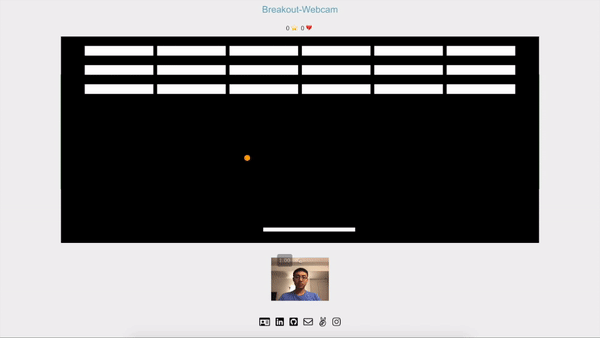
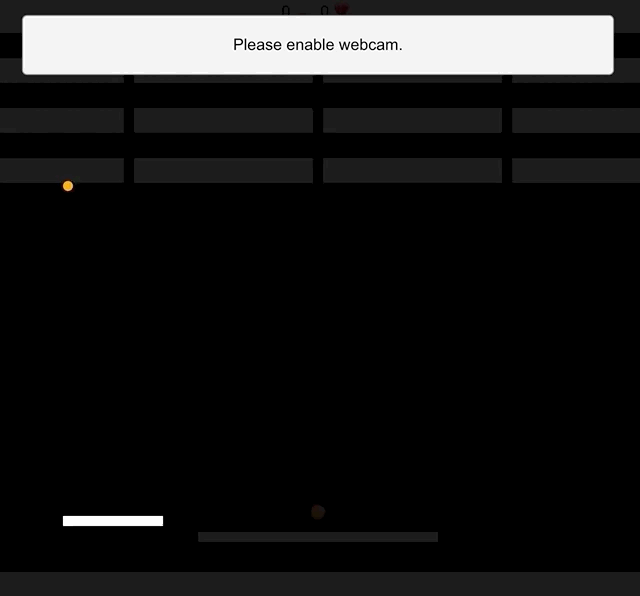

# Breakout-Webcam

___
[Live Link](https://huangtonyj.github.io/Breakout-Webcam/)

[Breakout-Webcam](https://huangtonyj.github.io/Breakout-Webcam/) is a classic Atari Breakout game powered by machine learning to play with hand gestures. It can be played with a keyboard or waving hand gestures.



___

## Technologies Used

* TensorFlow.js
* JavaScript
* HTML5 + Canvas
* CSS3
* Webpack

___

## How did I go about building this game? Tradeoffs explained.

Given a week to complete this project, implementing some sort of machine learning was defintely a stretch. The very first set of MVPs were to build a product playable with keyboard inputs. There were minor bugs and hiccups along the way, like when the ball gained too much speed and skipped frames thus avoided some collision detection logic.

After building a playable game with keyboard inputs, the immediate next step was to incorporate webcam controls. This was no easy feat but I have to thank the [Google TensorFlow.js](https://js.tensorflow.org/) team for wonderful examples to reference from. 

Before I dive in deeper into my design process, it is crucial to understand how it was built overall. A convolutional neural network (1 hidden layer) was used to train a model predicting 3 classes (left, right, neutral). A couple hundred images of a hand on the left side was used to classify left. Another couple hundred for the right. The neutral class (no hands but a happy face) is crucial in interpreting no movement.

Before building the interface, I was faced with two product design approaches and each one has their strength and weakness. The two approaches are:

1. Force players train a custom model by sampling their hand positions everytime before playing
    * Advantage: higher model prediction accuracy
    * Disadvantage: cumbersome user interface
2. Load a pre-trained model everytime and play immediately.
    * Advantage: direct, immediate joyful interaction
    * Disadvantage: lower accuracy and may result in poor user experience

The tradeoffs between the two are huge but I ultimately chose the later for a better user experience.

The advantage of the first approach is that it will be a more tailored model. Since this is a black box model, there is no easy way in determining how the model is trained exactly, results may vary based on user and background noise. I was able to indirectly infer from the results of the predictions under different conditions. My latest theory is that it predicts based on light contrast. Given a bright-lit background, placing a hand on the left side or moving my head to the left resulted in predicting left and vice-versa for the right. This led to believe the model isn't predicting based on hand recogition but based on light contrast. Nonetheless, the disadvantage is obvious from this observation. A player of different skin tone or different background lighting may have different results.

To execute the second approach, I trained a model based on couple lighting scenarios and saved the model and its weights. Upon loading the game, the user is faced with two options.

1. Play with webcam controls
2. Play with keyboard

If webcam controls was chosen, the webcam starts up and the trained model starts loading from memory. Prediction starts after both have initialized. The webcam captures a frame periodically and is fed through the model to predict an input for the game.

## Loading Spinner Easter Egg

While the webcam is starting and model is loading, I created a custom spinner that mimics the game with CSS.



```html
<div class="loader">
  <div class="platform"></div>
  <div class="ball"></div>
</div>
```

```css
.loader {
  position: absolute;
  top: 50%;
  left: 50%;
  -webkit-transform: translate(-50%, -50%);
  -ms-transform: translate(-50%, -50%);
  transform: translate(-50%, -50%);
  width: 510px;
  height: 500px;
  overflow: hidden;
}

.platform {
  height: 10px;
  width: 0;
  background: white;
  position: fixed;
  top: 77%;
  -webkit-animation: platform 2s ease-in-out infinite;
  animation: platform 2s ease-in-out infinite;
}

@keyframes platform {
  0% {
    left: 0;
    width: 100px;
  }

  50% {
    left: 400px;
    width: 100px;
  }

  100% {
    left: 0;
    width: 100px;
  }
}

.ball {
  height: 10px;
  width: 10px;
  border-radius: 50%;
  background: orange;
  position: fixed;
  top: 50%;

  -webkit-animation: ball 2s ease-in-out infinite;
  animation: ball 2s ease-in-out infinite;
}

@keyframes ball {
  0% {
    top: 10%;
    left: 0px;
  }
  25% {
    top: 75%;
  }
  50% {
    left: 500px;
    top: 10%;
  }
  75% {
    top: 75%;
  } 
  100% {
    left: 0px;
    top: 10%;
  }
}
```

___

## Features in the Pipeline:

* Train a more accurate model by
    * Training with both a dark and bright background.
    * Sampling from a diverse set of skin toned players.
* Visual/Audio cue that hand was out of webcam frame.
    * Players often move hand out of frame resulting in neutral prediction.
* Webcam compabilility with Safari browser.